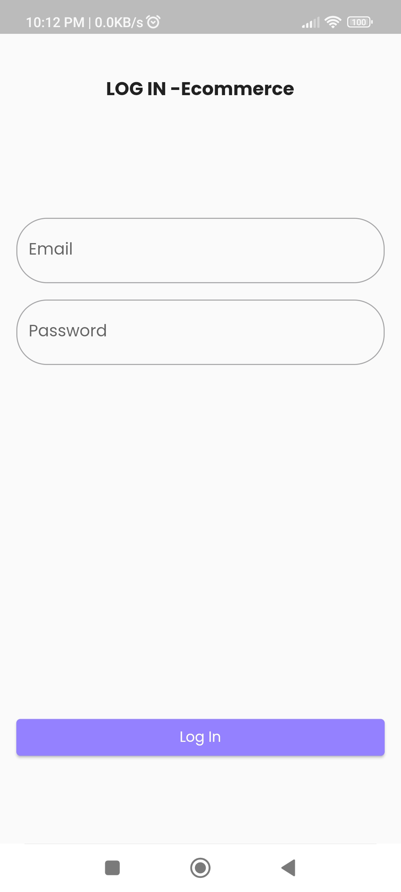
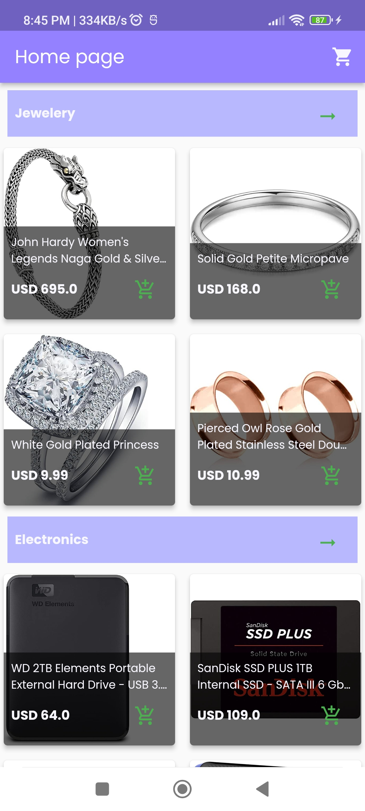
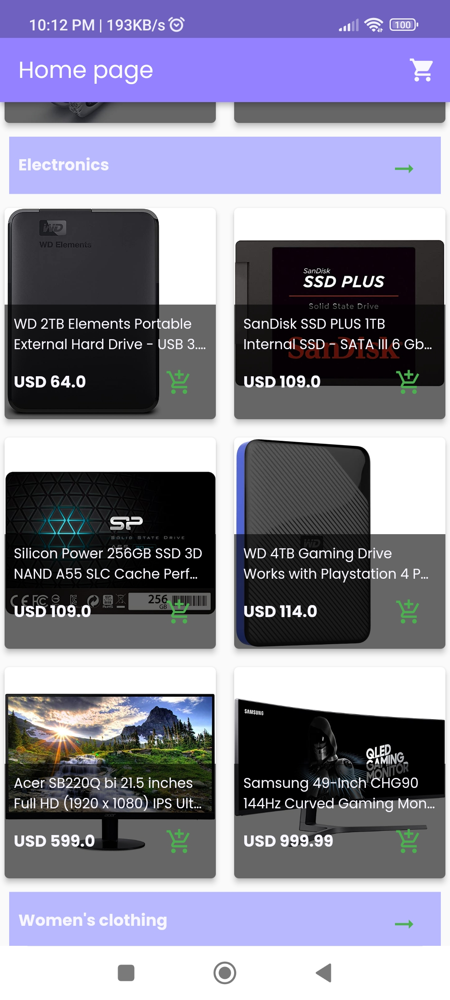
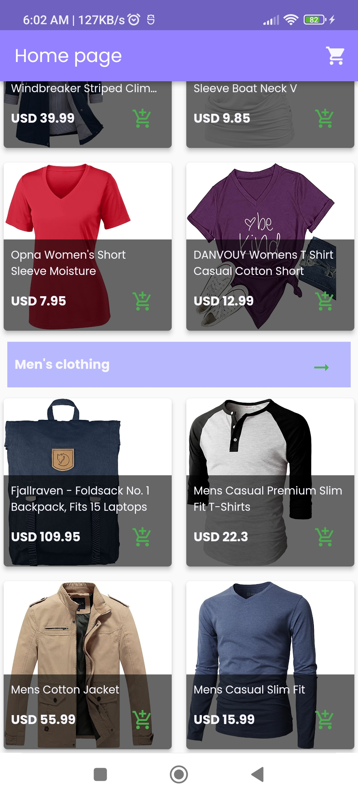
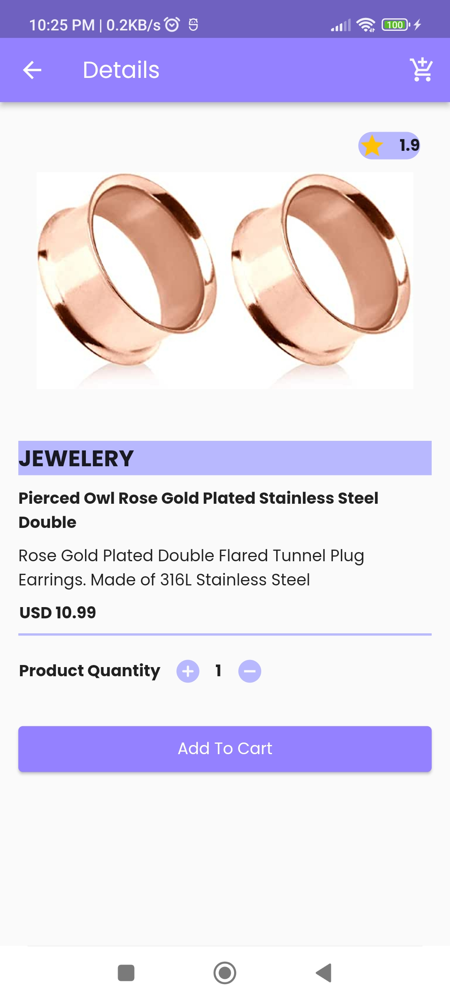
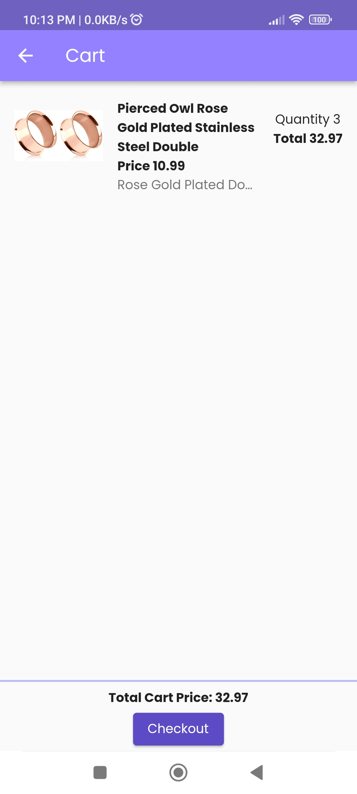
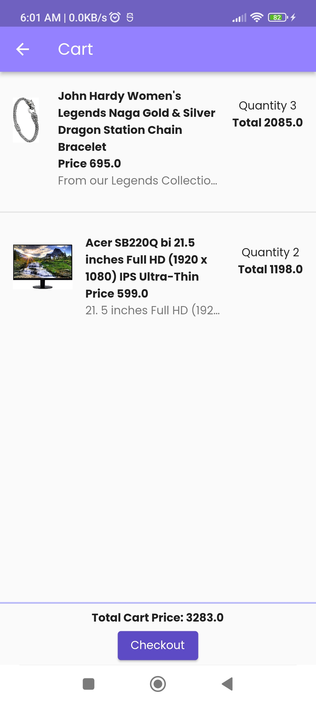
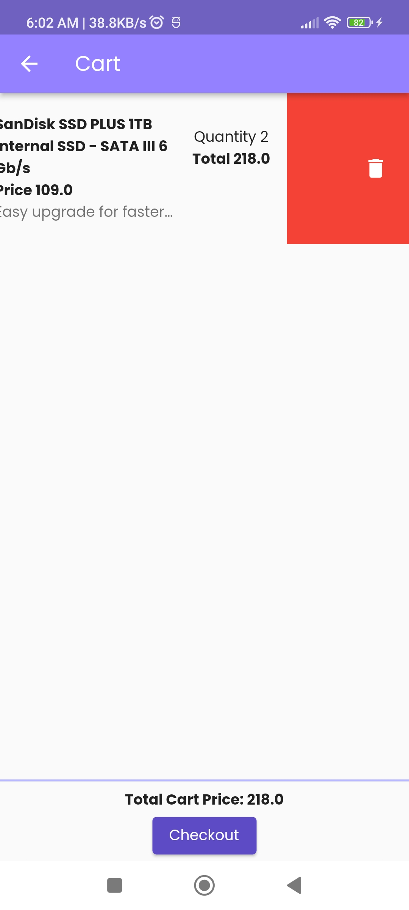
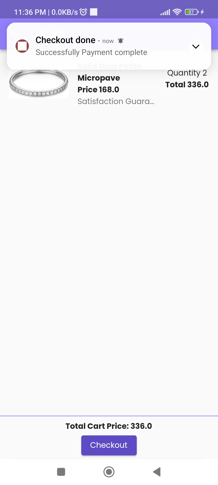

# E-Commerce Flutter App

This Flutter app is designed for an e-commerce platform, showcasing various product categories and allowing users to view products and add them to their cart.

## Features

- Home Page
- ALL Product Page
- Product details Page
- Cart

## Packages

 e-commerce app developed using the listed packages:

- **cupertino_icons (^1.0.2)**: This package provides Cupertino-style icons for iOS-flavored design in your Flutter app.

- **shared_preferences (^2.2.2)**: Useful for storing simple data persistently, like user preferences or settings.

- **get (^4.6.6)**: A package that simplifies navigation and route management in Flutter applications.

- **dio (^5.3.4)**: A powerful HTTP client for making network requests. You might use this for communicating with a server to fetch product data, user information, etc.

- **sliver_tools (^0.2.5)**: Provides widgets and utilities to help with sliver-based layouts. Sliver layouts are often used for creating complex, dynamic scrolling lists, like those in product catalogs or category displays in an e-commerce app.

- **sqflite (^2.3.0)**: A Flutter plugin for SQLite, which can be used for local database storage. This might be used for storing more structured or larger amounts of data locally, like product information or user orders.

- **path (^1.8.3)**: A package providing methods to work with file system paths. This could be used in conjunction with SQLite to manage database files or with other functionalities requiring file path manipulation.

- **flutter_local_notifications (^16.2.0)**: Allows for displaying local notifications within the app. In an e-commerce context, this could be used for order updates, promotions, etc.

- **firebase_core (^2.24.2)**: Firebase Core is the starting point for Firebase Flutter plugins. It's necessary for Firebase functionality to work in a Flutter app. It initializes the necessary Firebase services.

- **firebase_messaging (^14.7.9)**: Firebase Cloud Messaging (FCM) allows you to send notifications and messages to users across platforms. It enables you to send messages to your app users while the app is in the foreground, background, or even closed.

- **flutter_dotenv (^5.1.0)**: Allows you to load environment variables from a .env file. Useful for managing sensitive data or configuration settings.

## Color Reference
| Color             | Hex  |
| ----------------- | -----|
| Example Color |  #9381ff |
| Example Color |  #b8b8ff |
| Example Color |  #00b48a |

## Screenshots

